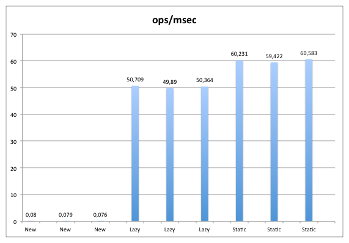

# Functional Error Handling

---

## Requirements

1. Arm a Nuke launcher <!-- .element: class="fragment" -->
2. Aim toward a Target <!-- .element: class="fragment" -->
3. Launch a Nuke and impact the Target <!-- .element: class="fragment" -->

---

## Requirements

1. __arm__ a __Nuke__ launcher
2. __aim__ toward a __Target__
3. __launch__ a __Nuke__ and __Impact__ the __target__

---

## Requirements

```scala
/** model */
case class Nuke()
case class Target()
case class Impacted()

def arm: Nuke = ???
def aim: Target = ???
def launch(target: Target, nuke: Nuke): Impacted = ???
```

---

## Exceptions

```scala
def arm: Nuke = throw new RuntimeException("SystemOffline")
def aim: Target = throw new RuntimeException("RotationNeedsOil")
def launch(target: Target, nuke: Nuke): Impacted = Impacted()
```

---

## Exceptions

```scala
def arm: Nuke = throw new RuntimeException("SystemOffline")
def aim: Target = throw new RuntimeException("RotationNeedsOil")
def launch(target: Target, nuke: Nuke): Impacted = Impacted()
```

Breaks Referential transparency

---

## Exceptions: Broken GOTO

```scala
def arm: Nuke = throw new RuntimeException("SystemOffline")
def aim: Target = throw new RuntimeException("RotationNeedsOil")
def launch(target: Target, nuke: Nuke): Impacted = Impacted()
```

They are a broken GOTO

---

## Exceptions: Broken GOTO

```scala
def arm: Nuke = throw new RuntimeException("SystemOffline")
def aim: Target = throw new RuntimeException("RotationNeedsOil")
def launch(target: Target, nuke: Nuke): Impacted = Impacted()

def attack: Future[Impacted] = Future(launch(arm, aim))
```

They are a broken GOTO... getting lost in async boundaries

---

## Exceptions

```
at java.lang.Throwable.fillInStackTrace(Throwable.java:-1)
at java.lang.Throwable.fillInStackTrace(Throwable.java:782)
- locked <0x6c> (a sun.misc.CEStreamExhausted)
at java.lang.Throwable.<init>(Throwable.java:250)
at java.lang.Exception.<init>(Exception.java:54)
at java.io.IOException.<init>(IOException.java:47)
at sun.misc.CEStreamExhausted.<init>(CEStreamExhausted.java:30)
at sun.misc.BASE64Decoder.decodeAtom(BASE64Decoder.java:117)
at sun.misc.CharacterDecoder.decodeBuffer(CharacterDecoder.java:163)
at sun.misc.CharacterDecoder.decodeBuffer(CharacterDecoder.java:194)
```

Abused to signal events in core libraries

---

## Exceptions

```java
try {
  doExceptionalStuff() //throws IllegalArgumentException
} catch (Throwable e) { //too broad matches:
    /*
    VirtualMachineError
    OutOfMemoryError
    ThreadDeath
    LinkageError
    InterruptedException
    ControlThrowable
    NotImplementedError
    */
}
```

Unsealed hierarchies, root of all evil 😈 

---

## Exceptions

```java
public class Throwable {
    /**
    * Fills in the execution stack trace. 
    * This method records within this Throwable object information 
    * about the current state of the stack frames for the current thread.
    */
    Throwable fillInStackTrace()
}
```

Potentially costly to construct based on VM impl and your current Thread stack size

---

## Exceptions



> [The Hidden Performance costs of instantiating Throwables](http://normanmaurer.me/blog/2013/11/09/The-hidden-performance-costs-of-instantiating-Throwables/)
> * New: Creating a new Throwable each time
> * Lazy: Reusing a created Throwable in the method invocation.
> * Static: Reusing a static Throwable with an empty stacktrace.

---

## Exceptions

Poor choices when using exceptions

- Modeling absence <!-- .element: class="fragment" -->
- Modeling known business cases that result in alternate paths <!-- .element: class="fragment" -->
- Async boundaries over unprincipled APIs (callbacks) <!-- .element: class="fragment" -->
- When people have no access to your source code <!-- .element: class="fragment" -->

---

## Exceptions

Maybe OK if...

- You don't expect someone to recover from it <!-- .element: class="fragment" -->
- You are contributor to a JVM in JVM internals <!-- .element: class="fragment" -->
- You want to create caos and mayhem to overthrow the government <!-- .element: class="fragment" -->
- In this talk <!-- .element: class="fragment" -->
- You know what you are doing <!-- .element: class="fragment" -->

---

## How do we model exceptional cases then?

---

# >>= 
# MONADS!

---

## Option ##

When modeling the potential absence of a value

---

## Option ##

When modeling the potential absence of a value

```scala
sealed trait Option[+A]
case class Some[+A](value: A) extends Option[A]
case object None extends Option[Nothing]
```

---

## Option ##

Useful combinators

```scala
def fold[B](ifEmpty: ⇒ B)(f: (A) ⇒ B): B //inspect all paths
def map[B](f: (A) ⇒ B): Option[B] //transform contents
def flatMap[B](f: (A) ⇒ Option[B]): Option[B] //monadic bind to another option
def filter(p: (A) ⇒ Boolean): Option[A] //filter with predicate
def getOrElse[B >: A](default: ⇒ B): B //extract or provide alternative
```

Garbage

```scala
def get: A //NoSuchElementException if empty (╯°□°）╯︵ ┻━┻
```

---

## Option ##

How would our example look like?

```scala
def arm: Option[Nuke] = None
def aim: Option[Target] = None
def launch(target: Target, nuke: Nuke): Option[Impacted] = Some(Impacted())
```

---

## Option ##

Pain to deal with if your lang does not have proper Monads or syntax support

```scala
def attackImperative: Option[Impacted] = {
  var impact: Option[Impacted] = None
  val optionNuke = arm
  if (optionNuke.isDefined) {
    val optionTarget = aim
    if (optionTarget.isDefined) {
      impact = launch(optionTarget.get, optionNuke.get)
    }
  }
  impact
}
```

---

## Option ##

Easy to work with if your lang supports monad comprehensions or special syntax

```scala
def attackMonadic: Option[Impacted] =
  for {
    nuke <- arm
    target <- aim
    impact <- launch(target, nuke)
  } yield impact
```

---

## Try ##

When a computation may fail with a runtime exception

---

## Try ##

When a computation may fail with a runtime exception

```scala
sealed trait Try[+T]
case class Failure[+T](exception: Throwable) extends Try[T]
case class Success[+T](value: T) extends Try[T]
```

---

## Try ##

Useful combinators

```scala
def fold[U](fa: (Throwable) ⇒ U, fb: (T) ⇒ U): U //inspect all paths
def map[U](f: (T) ⇒ U): Try[U] //transform contents
def flatMap[U](f: (T) ⇒ Try[U]): Try[U] //monadic bind to another Try
def filter(p: (T) ⇒ Boolean): Try[T] //filter with predicate
def getOrElse[U >: T](default: ⇒ U): U // extract the value or provide an alternative if exception
```

Garbage

```scala
def get: T //throws the captured exception if not a Success (╯°□°）╯︵ ┻━┻
```

---

## Try ##

How would our example look like?

```scala
def arm: Try[Nuke] = 
  Try(throw new RuntimeException("SystemOffline"))
  
def aim: Try[Target] = 
  Try(throw new RuntimeException("RotationNeedsOil"))
  
def launch(target: Target, nuke: Nuke): Try[Impacted] = 
  Try(throw new RuntimeException("MissedByMeters"))
```

---

## Try ##

Pain to deal with if your lang does not have proper Monads or syntax support

```scala
def attackImperative: Try[Impacted] = {
  var impact: Try[Impacted] = null
  var ex: Throwable = null
  val tryNuke = arm
  if (tryNuke.isSuccess) {
    val tryTarget = aim
    if (tryTarget.isSuccess) {
      impact = launch(tryTarget.get, tryNuke.get)
    } else {
      ex = tryTarget.failed.get
    }
  } else {
    ex = tryNuke.failed.get
  }
  if (impact != null) impact else Try(throw ex)
}
```

---

## Try ##

Easy to work with if your lang supports monadic comprehensions

```scala
def attackMonadic: Try[Impacted] =
  for {
    nuke <- arm
    target <- aim
    impact <- launch(target, nuke)
  } yield impact
```

---

## Either ##

When dealing with a known alternate return path

---

## Either ##

When a computation may fail or dealing with known alternate return path

```scala
sealed abstract class Either[+A, +B]
case class Left[+A, +B](value: A) extends Either[A, B]
case class Right[+A, +B](value: B) extends Either[A, B]
```

---

## Either ##

Useful combinators

```scala
def fold[C](fa: (A) ⇒ C, fb: (B) ⇒ C): C //inspect all paths
def map[Y](f: (B) ⇒ Y): Either[A, Y] //transform contents
def flatMap[AA >: A, Y](f: (B) ⇒ Either[AA, Y]): Either[AA, Y] //monadic bind if Right
def filterOrElse[AA >: A](p: (B) ⇒ Boolean, zero: ⇒ AA): Either[AA, B] //filter with predicate
def getOrElse[BB >: B](or: ⇒ BB): BB // extract the value or provide an alternative if a Left
```

Garbage

```scala
toOption.get, toTry.get //Looses information if not a Right (╯°□°）╯︵ ┻━┻
```

---

## Either ##

What goes on the `Left`?

```scala
def arm: Either[?, Nuke] = ???
def aim: Either[?,Target] = ???
def launch(target: Target, nuke: Nuke): Either[?, Impacted] = ???
```

---

## Either ##

Alegbraic Data Types (sealed families)

```scala
sealed trait NukeException
case class SystemOffline() extends NukeException
case class RotationNeedsOil() extends NukeException
case class MissedByMeters(meters : Int) extends NukeException
```

---

## Either ##

Algebraic data types (sealed families)

```scala
def arm: Either[SystemOffline, Nuke] = Right(Nuke())
def aim: Either[RotationNeedsOil,Target] = Right(Target())
def launch(target: Target, nuke: Nuke): Either[MissedByMeters, Impacted] = Left(MissedByMeters(5))
```

---

## Either ##

Pain to deal with if your lang does not have proper Monads or syntax support

```scala
def attackImperative: Either[NukeException, Impacted] = {
  var result: Either[NukeException, Impacted] = null
  val eitherNuke = arm
  if (eitherNuke.isRight) {
    val eitherTarget = aim
    if (eitherTarget.isRight) {
      result = launch(eitherTarget.toOption.get, eitherNuke.toOption.get)
    } else {
      result = Left(RotationNeedsOil())
    }
  } else {
    result = Left(SystemOffline())
  }
  result
}
```

---

## Either ##

Easy to work with if your lang supports monadic comprehensions

```scala
def attackMonadic: Either[NukeException, Impacted] =
  for {
    nuke <- arm
    target <- aim
    impact <- launch(target, nuke)
  } yield impact
```

---

Can we further generalize error handling and launch nukes on any `M[_]`?

---

### (Monad|Applicative)Error[M[_], E] ###

```scala
/**
 * A monad that also allows you to raise and or handle an error value.
 * This type class allows one to abstract over error-handling monads.
 */
trait MonadError[F[_], E] extends ApplicativeError[F, E] with Monad[F] {
  ...
}
```

---

### (Monad|Applicative)Error[M[_], E] ###
 
Many useful methods to deal with potentially failed monads

```scala
def raiseError[A](e: E): F[A]
def handleError[A](fa: F[A])(f: E => A): F[A]
def attempt[A](fa: F[A]): F[Either[E, A]]
def attemptT[A](fa: F[A]): EitherT[F, E, A]
def recover[A](fa: F[A])(pf: PartialFunction[E, A]): F[A]
def catchNonFatal[A](a: => A)(implicit ev: Throwable <:< E): F[A]
def catchNonFatalEval[A](a: Eval[A])(implicit ev: Throwable <:< E): F[A]
```

---

### (Monad|Applicative)Error[M[_], E] ###
 
Cats instances available for

```scala
MonadError[Option, Unit]
MonadError[Try, Throwable]
MonadError[Either[E, ?], E]
```

---

### (Monad|Applicative)Error[M[_], E] ###
 
How can we generalize and implement this to any `M[_]`?

```scala
def arm: M[Nuke] = ???
def aim: M[Target] = ???
def launch(target: Target, nuke: Nuke): M[Impacted] = ???
```

---

### (Monad|Applicative)Error[M[_], E] ###
 
Higher Kinded Types!

```scala
def arm[M[_]]: M[Nuke] = ???
def aim[M[_]]: M[Target] = ???
def launch[M[_]](target: Target, nuke: Nuke): M[Impacted] = ???
```

---

### (Monad|Applicative)Error[M[_], E] ###
 
Typeclasses!

```scala
import cats._
import cats.implicits._

def arm[M[_] : NukeMonadError]: M[Nuke] = 
  Nuke().pure[M]
  
def aim[M[_] : NukeMonadError]: M[Target] = 
  Target().pure[M]
  
def launch[M[_] : NukeMonadError](target: Target, nuke: Nuke): M[Impacted] =
  (MissedByMeters(5000): NukeException).raiseError[M, Impacted]
```

---

### (Monad|Applicative)Error[M[_], E] ###
 
An abstract program is born

```scala
def attack[M[_] : NukeMonadError]: M[Impacted] = 
  (aim[M] |@| arm[M]).tupled.flatMap((launch[M] _).tupled)
```

---

### (Monad|Applicative)Error[M[_], E] ###
 
Provided there is an instance of `MonadError[M[_], A]` 
for other types you abstract away the return type

```scala
attack[Either[NukeException, ?]]
attack[Future[Either[NukeException, ?]]]
```

---

### Abstraction ###
 
- Benefits 
    - Safer code <!-- .element: class="fragment" -->
    - Less tests <!-- .element: class="fragment" -->
    - More runtime choices <!-- .element: class="fragment" -->

- Issues <!-- .element: class="fragment" -->
    - Performance cost? <!-- .element: class="fragment" -->
    - Newbies & OOP dogmatics complain about legibility <!-- .element: class="fragment" -->
    - Advanced types + inference == higher compile times <!-- .element: class="fragment" -->

---

### Recap ###

| *Error Handling* | *When to use*               | *Java* | *Kotlin* | *Scala* |
|------------------|--------------------------- -|--------|----------|---------|
| *Exceptions*     | ~Never                      | x      | x        | x       |
| *Option*         | Modeling Absence            | ?      | x        | x       |
| *Try*            | Capturing Exceptions        | ?      | ?        | x       |
| *Either*         | Modeling Alternate Paths    | ?      | ?        | x       |
| *MonadError*     | Abstracting away concerns   | -      | -        | x       |

---

### Recap ###
 
What if my lang does not support some of these things?

1. Build it yourself <!-- .element: class="fragment" -->
2. Ask lang designers to include HKTs, Typeclasses, ADT and others <!-- .element: class="fragment" -->
3. We are part of the future of programming <!-- .element: class="fragment" -->

---

### Thanks! ###
 
@raulraja @47deg

---
